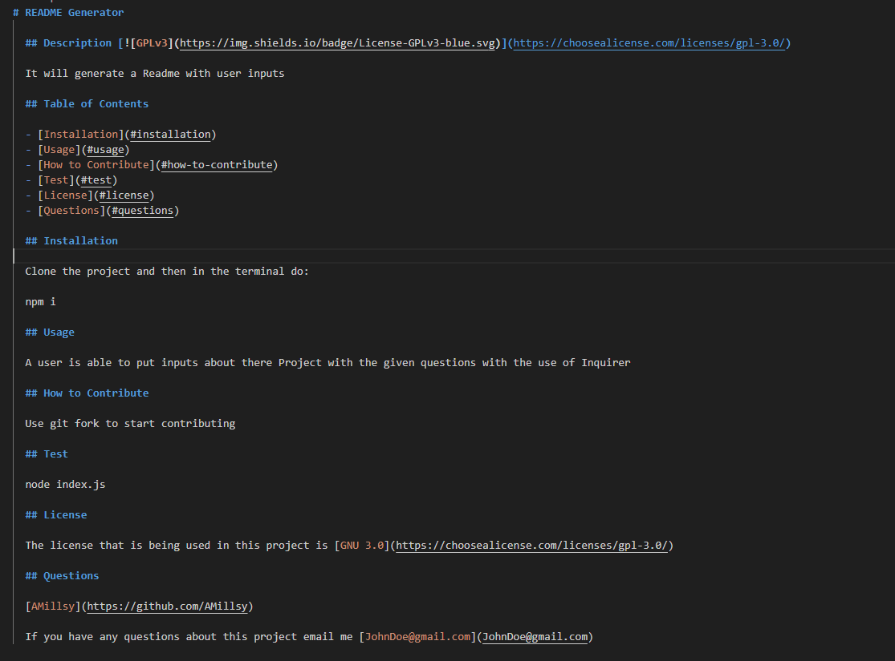
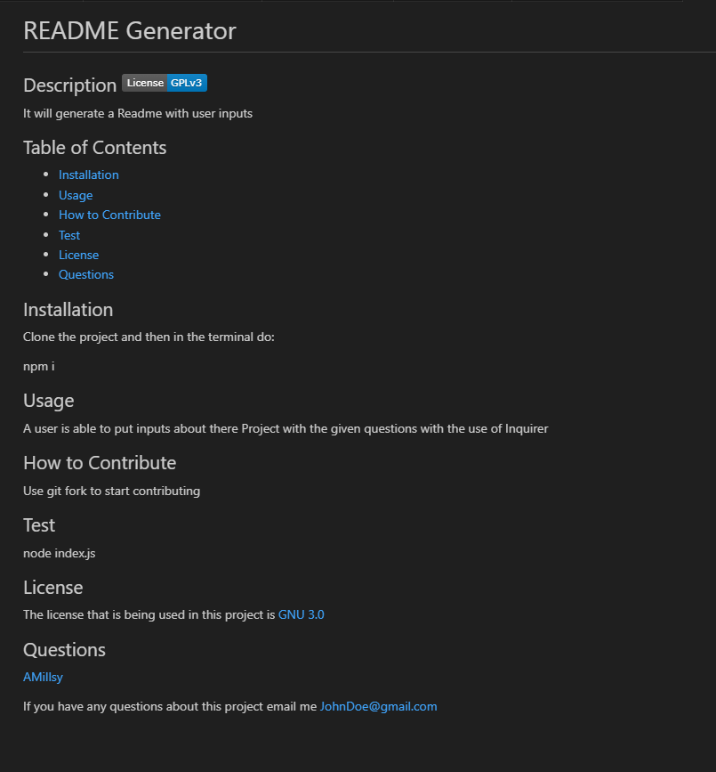

# Readme Generator

## Description

Able to quickly create a Readme me with set paramaters using the library Inquirer.

## Table of Contents

- [Installation](#installation)

## Installation

Clone the project and then in the terminal do:

```bash
  npm i;
```

## Usage

### Run app

Run the app by using:

```bash
node index.js;
```

### Answer Questions

Answers the questions that are presented on the CLI


### Readme gets Generated

Readme will be written to the file system at ReadmeExample.md




## Test

Able to use app by:

```bash
node index.js
```
